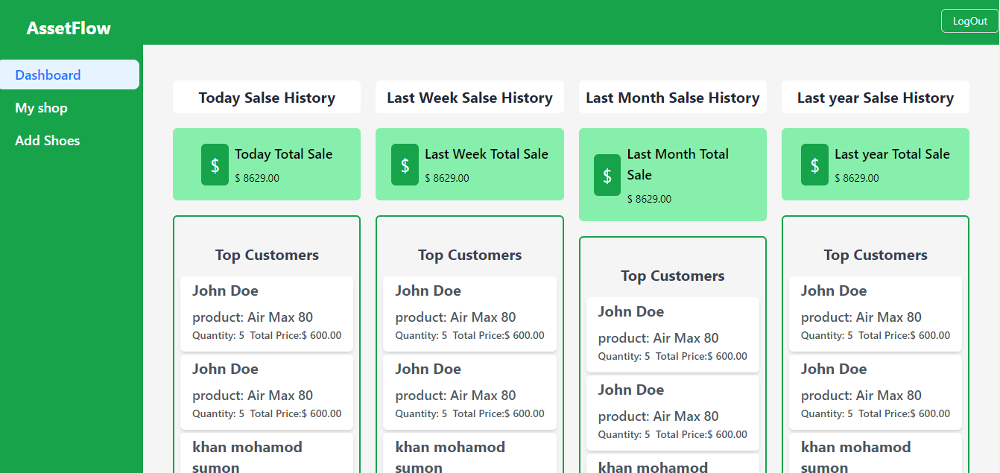

# Inventory Management Frontend

Project Image

## Live URL

Live Demo: https://tourmaline-crostata-3a2a2e.netlify.app/register

## Description

The Inventory Management Frontend is a modern web application built to efficiently manage inventory for businesses of all sizes. It provides a user-friendly interface for managing products, tracking sales, and generating reports. With its intuitive design and powerful features, it streamlines inventory management processes, saving time and improving productivity.

## Features

- **Product Management**: Easily add, edit, and delete products from the inventory.
- **Sales Tracking**: Keep track of sales transactions in real-time, including quantity sold and revenue generated.
- **Reporting**: Generate detailed reports on inventory levels, sales performance, and more.
- **User Authentication**: Secure user authentication system to protect sensitive data.
- **Responsive Design**: Fully responsive layout ensures seamless user experience across devices.

## Technologies Used

- **React**: Frontend JavaScript library for building user interfaces.
- **Ant Design**: UI library for React that provides a set of high-quality components and layouts.
- **Redux Toolkit**: State management library for managing application state.
- **React Router**: Declarative routing for React applications, enabling navigation between different views.
- **TypeScript**: Superset of JavaScript that adds static typing and other advanced features.
- **Vite**: Build tool that provides fast and efficient development and production workflows.
- **ESLint**: JavaScript linting tool for identifying and fixing code errors and inconsistencies.
- **Tailwind CSS**: Utility-first CSS framework for quickly building custom designs.

## Getting Started

1. Clone the repository:

   ```bash
   git clone https://github.com/your-username/inventory-management-frontend.git

1. Clone the repository:

   ```bash
    cd inventory-management-frontend
    npm install

1. Clone the repository:

   ```bash
    npm run dev

        ## Usage

### Add Products
Navigate to the "Products" section and click on "Add Product" to add new products to the inventory.

### Track Sales
Use the "Sales" section to view and track sales transactions in real-time.

### Generate Reports
Access the "Reports" section to generate detailed reports on inventory levels, sales performance, and more.

### Manage Users
If you have administrative privileges, you can manage users and their permissions in the "Users" section.
